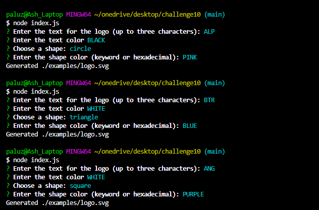
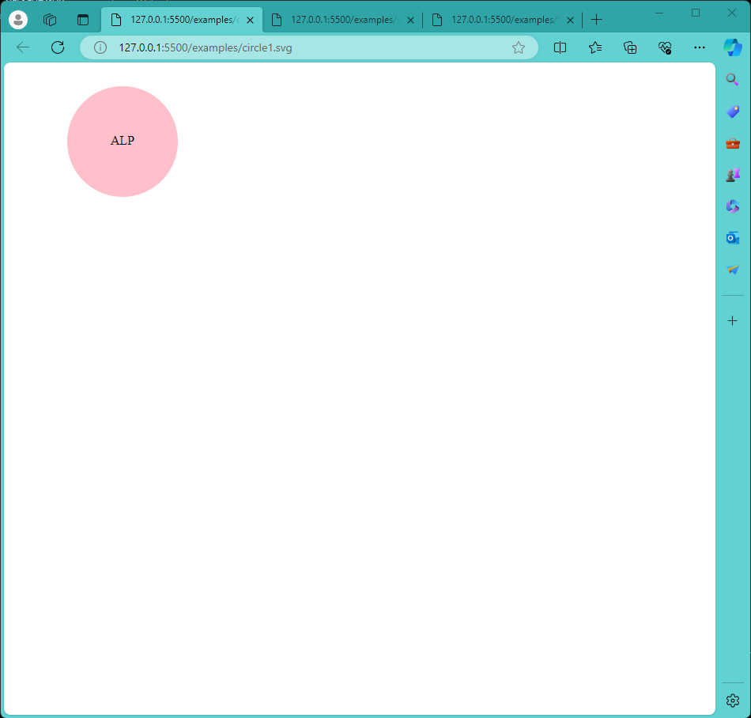
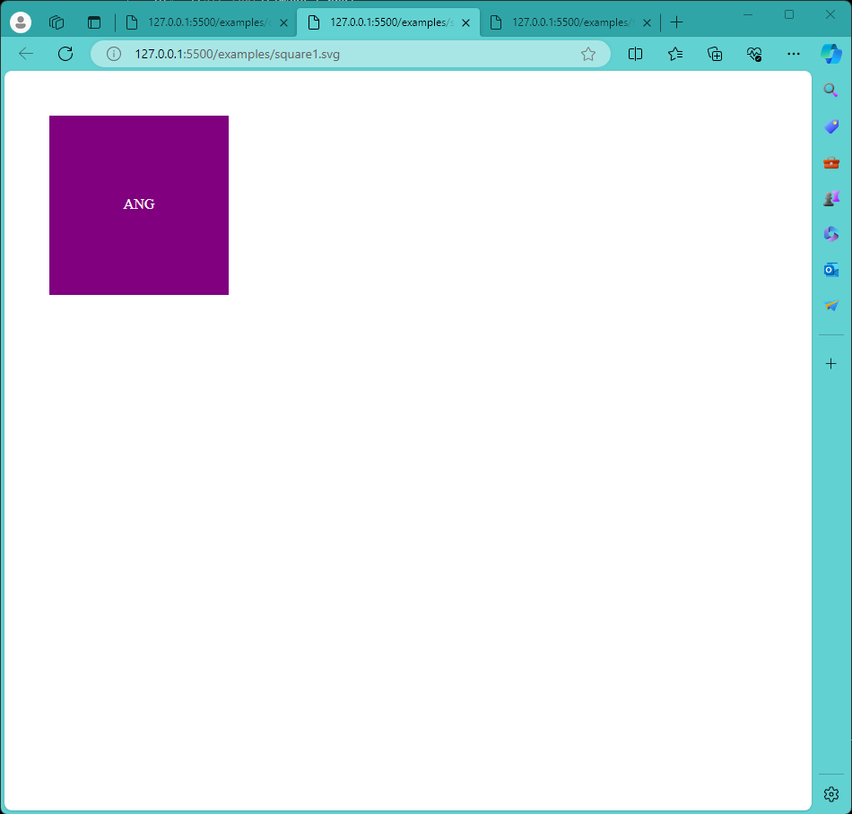
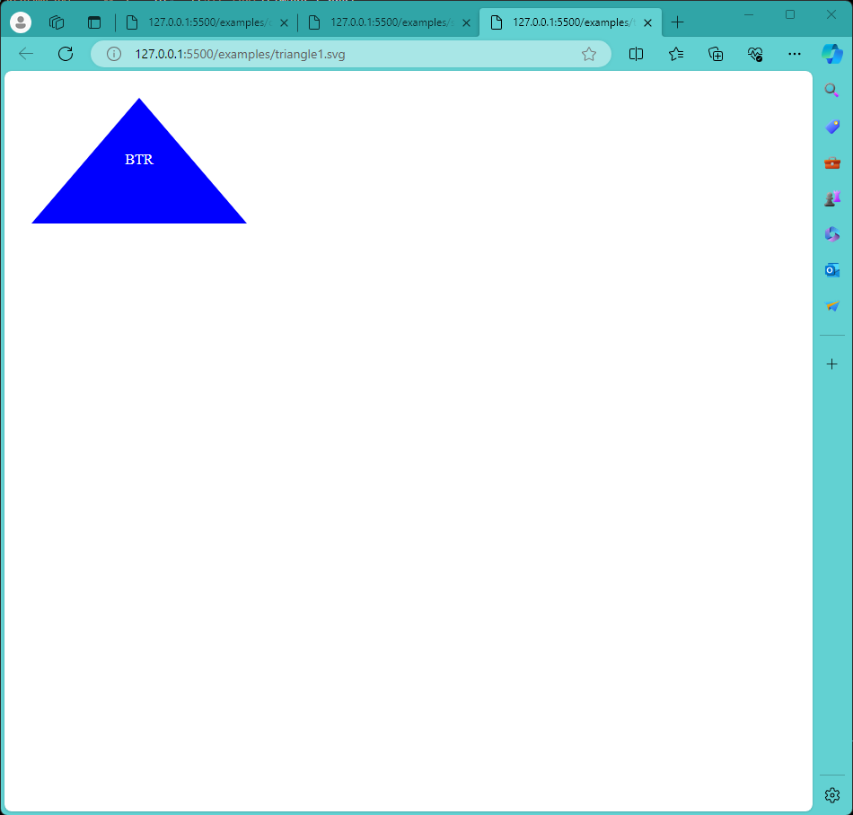

# SVG Logo Maker

## Challenge-10

## Table of Contents
- [Overview](#overview)
- [Behavior](#behavior)
- [Usage](#usage)
- [Assets](#assets)
- [Video-Demo](#video-demo)
- [Links](#links)

## Overview
SVG Logo Maker is a Node.js command-line application designed to create customizable SVG logos. The application allows users to select a color and shape, input text for the logo, and save the generated SVG to a .svg file.

## Behavior
- Customizable Logos: Choose from a variety of shapes and colors to create unique logos.
- Text Input: Input text to be included in the logo.
- SVG Output: Save the generated logo as an SVG file for easy integration into various projects.

## Usage
1. Open your terminal.
2. Navigate to the project directory.
3. Run the application using node app.js.
4. Follow the prompts to select a color, shape, and input text for your logo.
5. Once completed, the generated SVG will be saved to a .svg file in the project directory.

## Assets

## Video Demo
Video link: https://drive.google.com/file/d/1iBML7QtFdQdPAuIrjs3JiqKQNCNAvfb-/view

## Links
GitHub: https://github.com/ASHLOUISE/Challenge10.git
